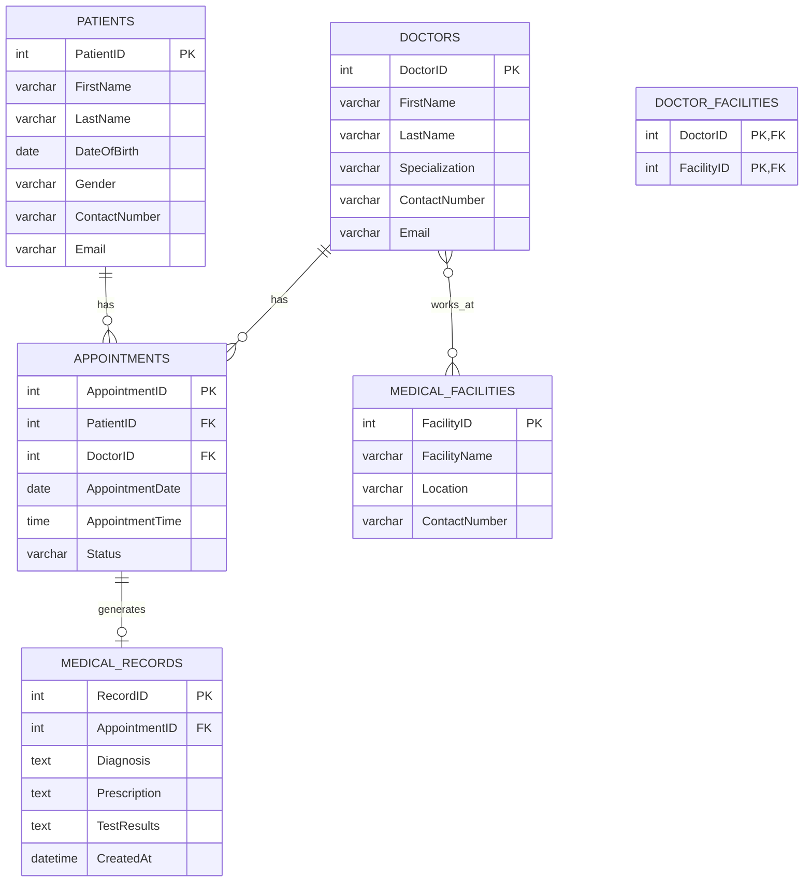

# Medical Database System

## Overview
The Medical Database System is designed to manage healthcare-related data efficiently, integrating information about patients, doctors, appointments, medical records, and medical facilities. The database schema is normalized to the Third Normal Form (3NF) to eliminate insertion, update, and deletion anomalies and to ensure data integrity.

## Entities and Attributes
Below are the entities with their attributes, including primary and foreign keys:

1. **Patients**
   - `PatientID` (Primary Key, Integer)
   - `FirstName` (Varchar)
   - `LastName` (Varchar)
   - `DateOfBirth` (Date)
   - `Gender` (Varchar)
   - `ContactNumber` (Varchar)
   - `Email` (Varchar)

2. **Doctors**
   - `DoctorID` (Primary Key, Integer)
   - `FirstName` (Varchar)
   - `LastName` (Varchar)
   - `Specialization` (Varchar)
   - `ContactNumber` (Varchar)
   - `Email` (Varchar)

3. **Appointments**
   - `AppointmentID` (Primary Key, Integer)
   - `PatientID` (Foreign Key referencing Patients, Integer)
   - `DoctorID` (Foreign Key referencing Doctors, Integer)
   - `AppointmentDate` (Date)
   - `AppointmentTime` (Time)
   - `Status` (Varchar, e.g., Scheduled, Completed, Cancelled)

4. **Medical Records**
   - `RecordID` (Primary Key, Integer)
   - `AppointmentID` (Foreign Key referencing Appointments, Integer)
   - `Diagnosis` (Text)
   - `Prescription` (Text)
   - `TestResults` (Text)
   - `CreatedAt` (DateTime)

5. **Medical Facilities**
   - `FacilityID` (Primary Key, Integer)
   - `FacilityName` (Varchar)
   - `Location` (Varchar)
   - `ContactNumber` (Varchar)

6. **Doctor_Facilities** (Junction table for many-to-many relationship)
   - `DoctorID` (Foreign Key referencing Doctors, Integer)
   - `FacilityID` (Foreign Key referencing Medical Facilities, Integer)
   - Composite Primary Key: (`DoctorID`, `FacilityID`)

## Relationships
- **Patients to Appointments**: One-to-Many (One patient can have multiple appointments, but each appointment is associated with one patient).
- **Doctors to Appointments**: One-to-Many (One doctor can have multiple appointments, but each appointment is associated with one doctor).
- **Appointments to Medical Records**: One-to-One (Each appointment may have one medical record, and each medical record corresponds to one appointment).
- **Doctors to Medical Facilities**: Many-to-Many (A doctor can work in multiple facilities, and a facility can have multiple doctors), implemented via the `Doctor_Facilities` junction table.

## ER Diagram
The following ER Diagram is represented in Mermaid syntax:

## Normalization
The database schema is normalized to the Third Normal Form (3NF) to ensure no insertion, update, or deletion anomalies and to remove transitive dependencies. Below is the normalization process:

### First Normal Form (1NF)
- **Requirement**: All attributes must be atomic, and there should be no repeating groups.
- **Analysis**: All attributes (e.g., `FirstName`, `ContactNumber`, `Diagnosis`) are atomic. There are no repeating groups or multi-valued attributes in any entity.
- **Result**: The schema is already in 1NF.

### Second Normal Form (2NF)
- **Requirement**: The schema must be in 1NF, and all non-key attributes must be fully functionally dependent on the entire primary key (no partial dependencies).
- **Analysis**:
  - **Patients, Doctors, Medical Facilities**: These have simple primary keys (`PatientID`, `DoctorID`, `FacilityID`). All attributes depend fully on their respective primary keys.
  - **Appointments**: Primary key is `AppointmentID`. All attributes (`PatientID`, `DoctorID`, `AppointmentDate`, `AppointmentTime`, `Status`) depend fully on `AppointmentID`.
  - **Medical Records**: Primary key is `RecordID`. All attributes (`AppointmentID`, `Diagnosis`, `Prescription`, `TestResults`, `CreatedAt`) depend fully on `RecordID`.
  - **Doctor_Facilities**: Composite primary key (`DoctorID`, `FacilityID`). There are no non-key attributes, so no partial dependencies exist.
- **Result**: The schema is in 2NF.

### Third Normal Form (3NF)
- **Requirement**: The schema must be in 2NF, and there should be no transitive dependencies (non-key attributes should not depend on other non-key attributes).
- **Analysis**:
  - **Patients**: No transitive dependencies (e.g., `Email` does not depend on `ContactNumber`; both depend on `PatientID`).
  - **Doctors**: No transitive dependencies (e.g., `Specialization` does not depend on `ContactNumber`).
  - **Appointments**: No transitive dependencies (e.g., `AppointmentDate` does not depend on `PatientID` or `DoctorID` directly; all depend on `AppointmentID`).
  - **Medical Records**: No transitive dependencies (e.g., `Diagnosis` does not depend on `Prescription`).
  - **Medical Facilities**: No transitive dependencies (e.g., `Location` does not depend on `ContactNumber`).
  - **Doctor_Facilities**: No non-key attributes, so no transitive dependencies.
- **Result**: The schema is in 3NF.

## Design Considerations
- **Primary Keys**: Unique identifiers (`PatientID`, `DoctorID`, etc.) ensure each record is distinct.
- **Foreign Keys**: Enforce referential integrity (e.g., `PatientID` in `Appointments` references `Patients`).
- **Junction Table**: `Doctor_Facilities` handles the many-to-many relationship between `Doctors` and `Medical Facilities`.
- **Data Types**: Chosen to match attribute requirements (e.g., `Date` for `DateOfBirth`, `Text` for `Diagnosis` to accommodate lengthy descriptions).
- **Avoiding Anomalies**:
  - **Insertion**: Normalized tables prevent issues like inserting a medical record without an appointment.
  - **Update**: No redundant data (e.g., doctor’s contact info is stored only in `Doctors`).
  - **Deletion**: Foreign keys ensure dependent records (e.g., appointments) are handled appropriately to avoid orphaned records.

## Implementation Notes
- Use a relational database management system (e.g., MySQL, PostgreSQL) to implement this schema.
- Ensure foreign key constraints are enabled to maintain referential integrity.
- Indexes on foreign keys (`PatientID`, `DoctorID`, `AppointmentID`) can improve query performance.
- Consider adding constraints like `NOT NULL` for critical fields (e.g., `FirstName`, `ContactNumber`) and `CHECK` for `Status` to limit values (e.g., Scheduled, Completed, Cancelled).

This schema provides a robust foundation for a medical database system, ensuring scalability, data integrity, and efficient querying.